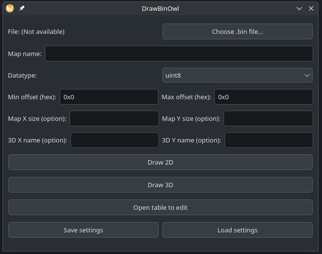
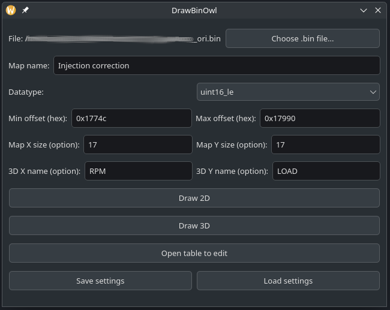
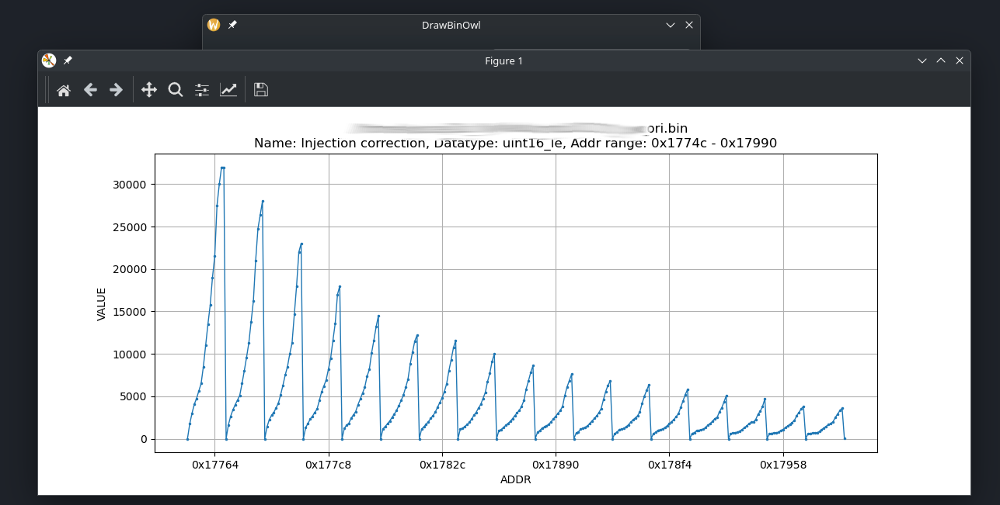
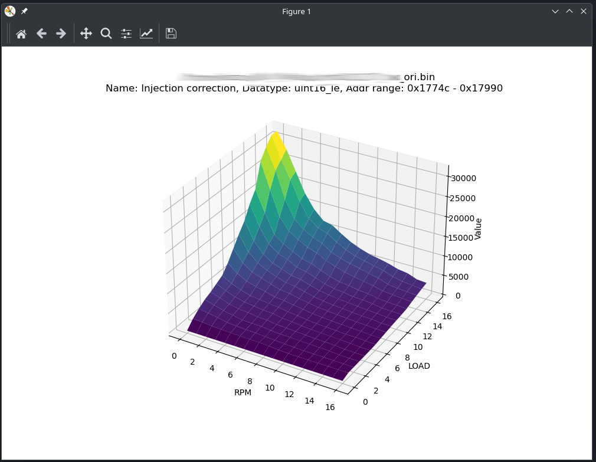
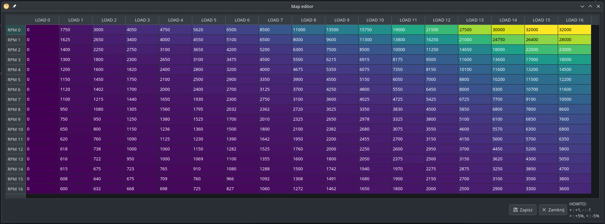

# _DrawBinOwl - Software for visualising and modifying ECU maps and firmware_

***If this software helped you or you think it is valuable, I would be grateful for a tip via [PayPal](https://paypal.me/k0sci3j), [donate me](https://www.paypal.com/donate/?hosted_button_id=YASECWP5FR7DL) or support on [Patreon](https://patreon.com/k0sci3j)***
___

This software was created as a spare-time project and as a result of the lack (?) of software for Linux that would offer basic capabilities similar to well-known packages for modifying ECU maps for Windows.  
The software is used to modify a separate fragment of firmware ripped from the ECU. 

 
Note: I have not (yet) implemented CRC calculation! 
  
There are 3 modules available:

* A 2D graph allowing you to find the binary fragment with the map.
  

* 3D graph for visualising maps.
  

* Simple interface for modifying found maps.
  

The created maps can be exported to a new bin file. Additionally, you can save the current settings to json (e.g. as individual maps).

**I am not responsible for damage caused by modifying your ECU** 

